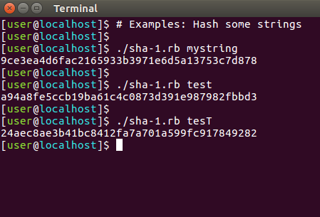

# ruby-SHA-1-implementation
An implementation of the famous SHA-1 hash function in a ruby script

## Principe
This ruby script can hash any string as SHA-1 would have done

## Commands
`./sha-1.rb mystring` 

## Online tool to check the result
http://www.sha1-online.com/
 

TODO: Handle special chars 
sha-2.rb not working yet

## Licence
This project is licensed under the GNU GPL v2. See GPL.txt for details.